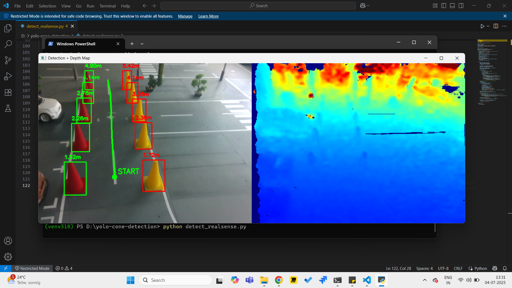
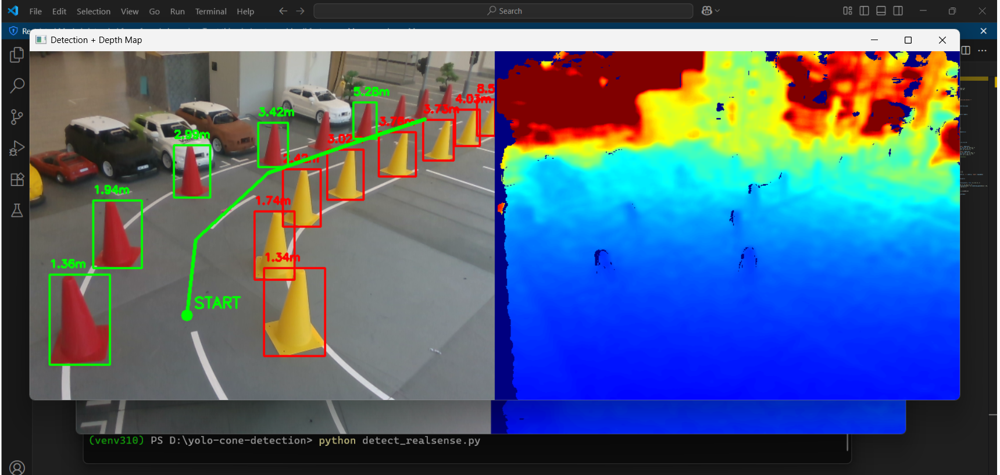

# Landmark Based Lane Detection

This project implements a robust, landmark-based lane detection system using a single Intel RealSense camera. It detects colored cones (as landmarks) and creates a navigable path for autonomous vehicles, such as those used in FSAC (Formula Student Autonomous China).

---

## Features

- **Cone Detection & Classification:** Uses YOLO V8 deep learning models to detect and classify cones (Red-left / Yellow-right) in real time.
- **Depth Integration:** Utilizes RealSense depth data to accurately localize cones in 3D space.
- **Landmark-Based Centerline Generation:** Pairs detected cones and computes a centerline path between them, including through curves.
- **Visualization:** Overlays bounding boxes, depth measurements, and computed path on the live video feed for easy debugging.
- **No LIDAR Required:** Achieves reliable path planning using only the RealSense camera (RGB + Depth).

---

## How It Works

1. **RealSense Camera Input:** Captures RGB and depth frames.
2. **Cone Detection:** Processes each RGB frame with a trained object detector (YOLO V8) to find and classify cones.
3. **Depth Processing:** For each detected cone, estimate its position relative to the vehicle using depth data.
4. **Landmark Pairing:** Matches left and right cones to create pairs and computes midpoints (centerline waypoints).
5. **Path Generation:** Connects midpoints to form a navigable centerline path.
6. **Visualization:** Annotates the video stream with cone boxes, distances, and the generated path.

---

## Setup

### Requirements

- Intel RealSense camera (D435 or D455)
- Python 3.10
- OpenCV
- pyrealsense2
- ultralytics (YOLO)
- numpy
- (Optional) scipy for advanced path smoothing

Install all dependencies with:

```bash
pip install -r requirements.txt
```

---

## Installation

```bash
git clone https://github.com/Raja-cool/Landmark_Based_Lane_Detection.git
cd Landmark_Based_Lane_Detection
pip install -r requirements.txt
```

---

## Usage

1. **Connect** your RealSense camera to your computer.
2. **Run the main detection script:**  
   ```bash
   detect_realsense.py
   ```
3. **View Results:**  
   The script will display the live video stream with detected cones, depth information, and the computed centerline path.

---

## Testing

Sample test images and a test video are provided for demonstration and testing purposes.

### Test Images

You can view detection results on static images:

<div align="center">
    
</div>
<br><br>
<div align="center">
    
</div>

[Watch the test video](Test_results/test_video.mp4)

### Test Video

A short demo video is provided of how cones are detected.  


[
